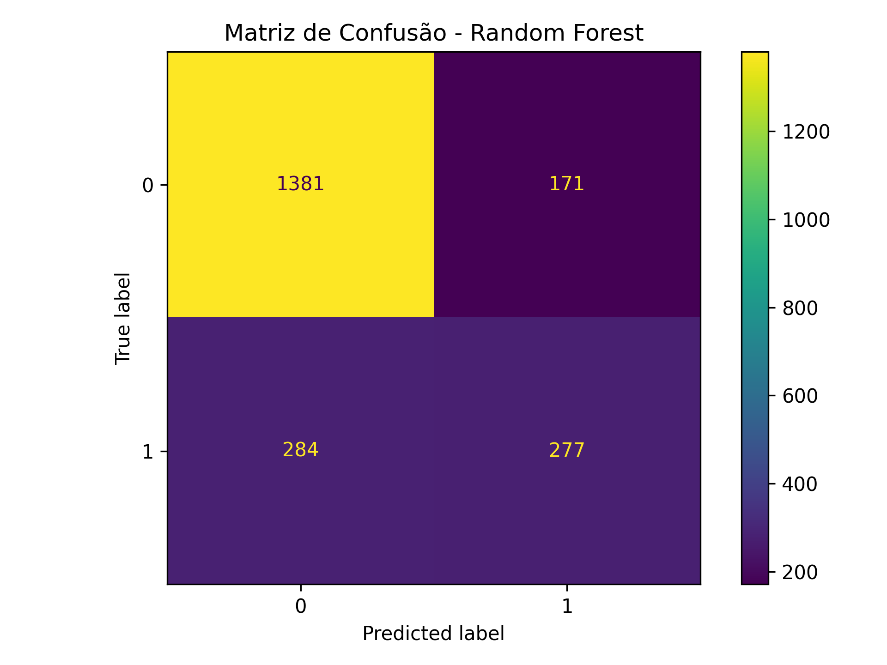
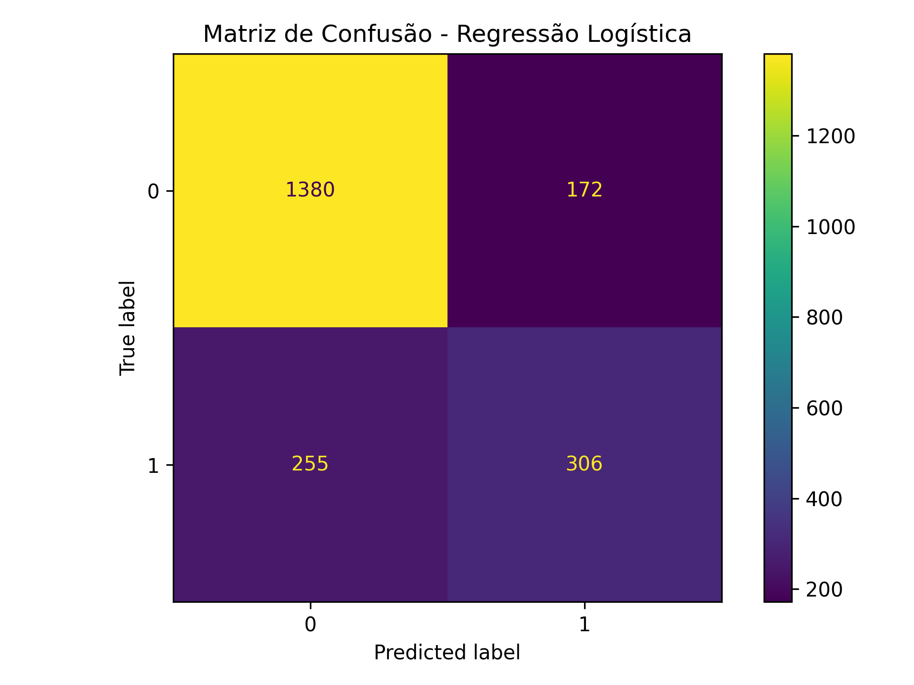
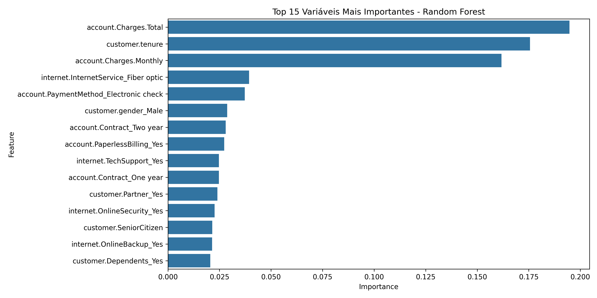

# 📊 Telecom XZapTurbo – Prevendo Evasão de Clientes (Churn)

Projeto de Machine Learning com foco em prever a evasão (churn) de clientes em uma operadora fictícia. Desenvolvido como parte do **Desafio 2** da formação em Data Science pela **ONE | TECH FOUNDATION ALURA**.

---

## 🎓 Formação

> **ONE | TECH FOUNDATION – Especialização em Data Science Alura**  
> Desenvolvimento técnico em Python, Machine Learning, Estatística Aplicada, Storytelling com Dados, Visualização, Engenharia de Dados, além de foco em **Soft Skills para mercado de trabalho e liderança de projetos**.

---

## 🎯 Objetivo

Antecipar a saída de clientes da empresa através de modelos preditivos de classificação, auxiliando na tomada de decisões estratégicas de retenção.

---

## ⚙️ Tecnologias e Bibliotecas Utilizadas

- `Pandas`, `NumPy` — manipulação e análise de dados
- `Matplotlib`, `Seaborn` — visualização gráfica
- `Scikit-learn` — machine learning (modelos, métricas, pré-processamento)
- `Imbalanced-learn (SMOTE)` — balanceamento de classes
- `OneHotEncoder`, `ColumnTransformer` — encoding de variáveis categóricas

---

## 🧠 Etapas do Projeto

1. **Importação dos dados tratados**
2. **Limpeza e preparo das variáveis**
3. **One-Hot Encoding** para variáveis categóricas
4. **Divisão dos dados** (treino/teste) com balanceamento via **SMOTE**
5. **Normalização** para modelos baseados em distância
6. **Criação de dois modelos preditivos**:
  - Regressão Logística (com normalização)
  - Random Forest (sem normalização)
7. **Validação cruzada** com `cross_val_score`
8. **Avaliação de desempenho** com métricas e **matriz de confusão**
9. **Análise de importância das variáveis**
10. **Conclusão com recomendações estratégicas**

---

## 📊 Resultados

| Modelo | Acurácia | Precision | Recall | F1-Score |
| --- | --- | --- | --- | --- |
| Regressão Logística | ~0.79 | 0.64–0.83 | 0.49–0.90 | Boa |
| Random Forest | ~0.79 | 0.68–0.82 | 0.48–0.88 | Boa |

- **Variáveis mais influentes:**
  - `account.Charges.Monthly`
  - `customer.tenure`
  - `account.PaymentMethod_Electronic check`

---

## 📌 Conclusão

O projeto demonstrou a viabilidade de prever clientes com tendência à evasão utilizando modelos supervisionados. A acurácia de ~79% é satisfatória para o contexto do negócio, mas **deve ser acompanhada com cautela** devido a possíveis ajustes futuros no balanceamento e no tratamento de variáveis.

---

## 👨‍💻 Autor

**Gilson Inacio da Silva**

[](https://www.linkedin.com/in/gilsoninsilva)  
[](https://github.com/gisengsoft)  
✉️ [gilson.engsoft@gmail.com](mailto:gilson.engsoft@gmail.com)  

---

## 📁 Estrutura do Projeto/Desafio 2

```
TelecomXZapTurbo-Churn-Prediction/

├── README.md

├── Telecom_XZapTurbo.ipynb

├── dados/

│   └── dados_tratados.csv

├── imagens/

│   ├── matriz_confusao_rf.png

│   ├── matriz_confusao_lr.png

│   └── importancia_variaveis.png

├── resultados/

│   └── classificacao_modelos.txt

├── requirements.txt

└── .gitignore
```

### 📊 Avaliações dos Modelos

#### 📌 Matriz de Confusão – Random Forest


#### 📌 Matriz de Confusão – Regressão Logística


#### 📌 Importância das Variáveis – Random Forest



---

## 🚀 Como executar

1. Clone o repositório:
  
  ```bash
  git clone https://github.com/gisengsoft/TelecomXZapTurbo-Churn-Prediction.git
  ```
  
2. Acesse a pasta:
  
  ```bash
  cd TelecomXZapTurbo-Churn-Prediction
  ```
  
3. Instale as dependências:
  
  ```bash
  pip install -r requirements.txt
  ```
  
4. Execute o notebook:
  
- Via Jupyter Notebook ou Google Colab

📄 Licença

Este projeto está licenciado sob a **MIT License** — veja o arquivo [LICENSE](LICENSE) para detalhes.